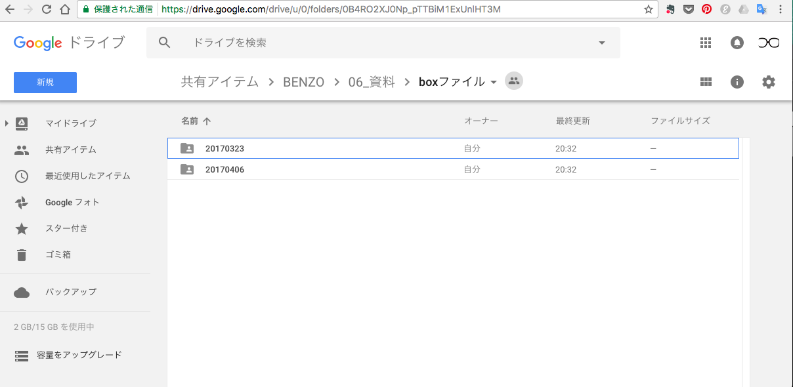

# benzo_setup
Benzoの勉強会までの環境ファイルの共有用リポジトリ  
(下記の作業をすると過去の勉強会に参加していない人も、同じ環境が手に入ります)

## 前提条件
### 下記のツールをインストールしていること
[VirtualBox(5.1)](https://www.virtualbox.org/)   
[vagrant(1.9.8)](https://www.vagrantup.com/)

## setup手順 
注意:下記のコマンドは、Linux系OSのコマンド操作を前提としています  
windowsの場合は、コマンドプロンプトに読み換える or  
ターミナルソフトを別途インストールしてください

1. boxファイルをダウンロード
下記のgoogleドライブより、自分のPCローカルにboxファイルを落としてください
https://drive.google.com/drive/u/0/folders/0B4RO2XJ0Np_pTTBiM1ExUnlHT3M  
- 勉強会が終了した時点での、仮想環境の状態を保存しています
- 直近の勉強会実施日ディレクトリのboxファイルを取得するようお願いいたします  


2. vagrantにboxを追加する
  ```bash
  ## boxファイルを落としたディレクトリに移動
  $ cd　インストール先path 
  ## box追加のコマンドを実行
  $ vagrant box add centos6.5_box ./benzo.box
  ```
3. box一覧への追加を確認  
  ```bash
  ## centos6.5_box が表示されること
  $ vagrant box list
  ```
4. vagrantファイルを新規作成する
  ```bash
  ## 作業ディレクトリ作成
  $ mkdir "作業用ディレクトリ"
  ## 作業ディレクトリへ移動
  $ cd "作業用ディレクトリ"
  ## vagrantの初期化
  $ vagrant init centos6.5_box 
  ## vagrantファイルができているのを確認
  # Vagrantfile
  $ cd  "作業用ディレクトリ"; ls
  ```
5. vagrant を起動し、ssh接続する
  ```sh
  ## サーバー起動
  $ vagrant up　　
  ## ssh接続
  #TeraTermなどのsshクライアントを使用する or 下記のコマンドで接続
  $vagrant ssh
  ```

## ここまで読んだら

